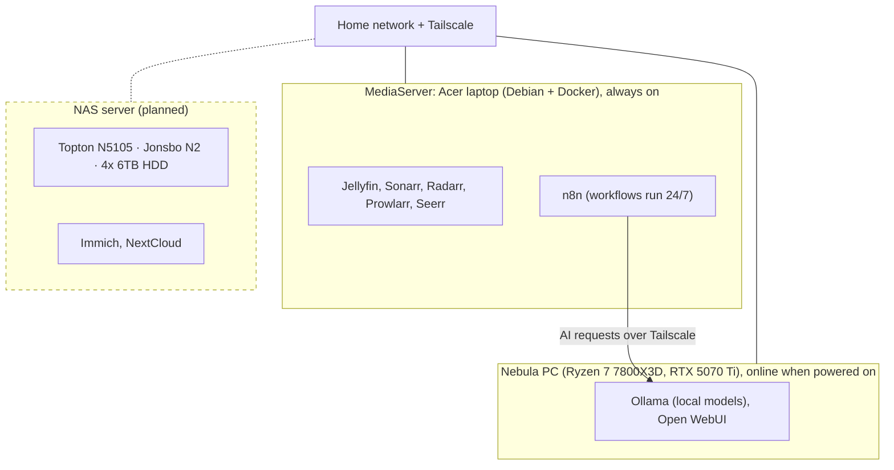
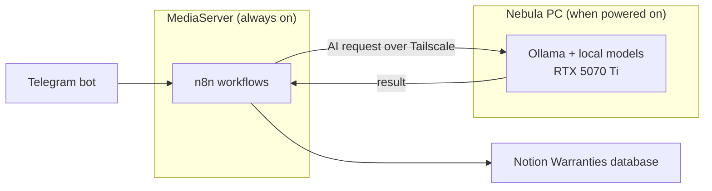
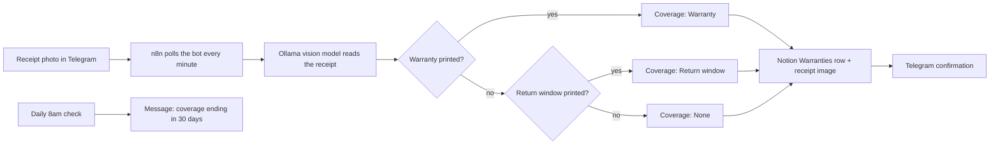

# HomeLab

Personal homelab for media, home automation, local AI and self-hosted infrastructure. Progress is logged in [CHANGELOG.md](CHANGELOG.md).

## Architecture

| Host | Hardware | Role | Status |
|---|---|---|---|
| MediaServer | Acer laptop | Media stack and n8n automation (always on) | 🟢 Live |
| Nebula PC | Ryzen 7 7800X3D, RTX 5070 Ti | Local AI (Ollama), online when powered on | 🟢 Live |
| NAS server | Topton N5105 NAS build | Cloud storage | 🟡 Planned — hardware sourced |

## Hardware

### MediaServer
- Hardware: Acer laptop (model and specs to add)
- OS: Debian, running Docker
- Role: media stack (Jellyfin, Sonarr, Radarr, Prowlarr, Seerr, Pi-hole, Speedtest tracker, Filebrowser, Home Assistant) and n8n, so workflows run 24/7
- Managed remotely over SSH from the Nebula PC

### Nebula PC
- CPU: Ryzen 7 7800X3D
- GPU: RTX 5070 Ti
- RAM: 32 GB
- Storage: 1 TB SSD
- OS: (Windows)
- Role: local AI (Ollama, Open WebUI). Ollama serves n8n on the MediaServer over Tailscale whenever the PC is on

### NAS server (planned) — Extreme Low Budget Build

Purpose: cloud storage (Immich and NextCloud). Sourced from AliExpress, Facebook Marketplace, and salvaged parts to keep cost down.

| Component | Name | Price | Notes |
|---|---|---|---|
| Motherboard | Topton NAS N5105 | $236.70 | Original listing unavailable; similar model ~$275 on Amazon |
| RAM | 2 × 8GB sticks | N/A | Salvaged from an old laptop |
| Case | Jonsbo N2 NAS Mini Case | $181.71 | |
| PSU | 500W SilverStone EX500-B | $109.00 | |
| HDD | 4 × 6TB HDD | — | Used data centre drives, bought via Facebook Marketplace |

Status: hardware sourced, build and OS setup not yet complete.

## How n8n and Ollama connect

n8n runs on the MediaServer so schedules, Telegram triggers and notifications are always running. Ollama stays on the Nebula PC because it needs the GPU. n8n sends its AI requests to Ollama over Tailscale, so it works without exposing Ollama to the internet.

- Always on: the MediaServer and n8n. Triggers, schedules and Notion updates keep working.
- Only when the Nebula PC is on: the Ollama step (reading receipts). If the PC is off, that step fails.
- Ollama is only reachable over Tailscale, not exposed publicly.
- When n8n moves between machines, update any hard-coded Ollama address in workflows. A `localhost` or `host.docker.internal` address points at the machine running n8n, not the Nebula PC.

## Services

**Media**
- Jellyfin
- Sonarr
- Radarr
- Prowlarr
- qBittorrent
- Seerr
- Pi-Hole (Network ad-blocker)
- Speedtest tracker (internet speed activity log)
- Filebrowser (visual Linux folder management)
- Home Assistant 

**Home automation**
- Home Assistant, with Tapo cameras and Google Calendar integration
- n8n (runs on the MediaServer, 24/7): receipt-to-warranty tracker (Telegram, local Ollama vision model on the Nebula PC over Tailscale, Notion). See [n8n/](n8n/README.md)

**Infrastructure**
- Vaultwarden
- Tailscale
- Uptime Kuma
- Portainer
- Watchtower
- Homepage dashboard

**AI**
- Ollama
- Open WebUI

**Finance**
- Notion tracker with Transactions and Warranties databases (ongoing) 

## n8n automation

**Receipt-to-warranty tracker** ([full write-up and workflow export](https://github.com/malvinkhan/HomeLab/blob/3977f7d82ff03f62636ad497dc321267fec12b73/n8n/README)): send a photo of a receipt to a Telegram bot and it is logged in the Notion Warranties database, with the receipt image attached. A local vision model on the Nebula PC reads the receipt, so nothing is sent to a cloud AI service. A daily check messages me when a warranty or return window is about to end.

## Current status and roadmap

- [ ] Assemble NAS server hardware (Topton N5105 build)
- [ ] Test/burn-in used HDDs (SMART checks, badblocks) before trusting data to them
- [ ] Choose NAS OS (e.g. TrueNAS, Unraid) and set up storage pool (RAID/RAIDZ) for redundancy
- [ ] Deploy Immich and NextCloud on the NAS
- [ ] Set up backups (no solution in place yet)
- [ ] Decide how n8n should handle the Nebula PC being off (retry, wake the PC automatically, or fall back to a cloud model)
- [ ] Document Acer laptop specs, Nebula PC OS and network layout
- [ ] Add docker-compose files to this repo (secrets excluded)
- [ ] Move Seerr into docker-compose (currently run with `docker run`)
- [ ] Exclude Jellyfin and Seerr from Watchtower auto-updates
- [ ] Re-enable the Jellyfin widget in Homepage once it supports Jellyfin 12

## Skills demonstrated

- Linux (Debian) administration and Docker
- Self-hosting and secure remote access (Tailscale, Vaultwarden)
- Workflow automation (n8n, Telegram Bot API, Notion API)
- Applying a local vision model to a real workflow (receipt extraction with Ollama)
- Local LLM hosting (Ollama, Open WebUI)
- Splitting services across machines: n8n always on, GPU-backed Ollama reached over Tailscale
- Monitoring and maintenance (Uptime Kuma, Watchtower, Portainer)
- Budget hardware sourcing and NAS build planning
- Troubleshooting: diagnosing breakages from major-version updates (see the changelog)
