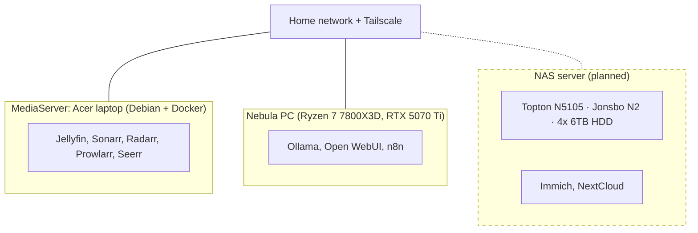

# HomeLab

Personal homelab for media, home automation, local AI and self-hosted infrastructure. Progress is logged in [CHANGELOG.md](CHANGELOG.md).

## Architecture

| Host | Hardware | Role | Status |
|---|---|---|---|
| MediaServer | Acer laptop | Media stack | 🟢 Live |
| Nebula PC | Ryzen 7 7800X3D, RTX 5070 Ti | Local AI and automation | 🟢 Live |
| NAS server | Topton N5105 NAS build | Cloud storage | 🟡 Planned — hardware sourced |

## Hardware

### MediaServer
- Hardware: Acer laptop (model and specs to add)
- OS: Debian, running Docker
- Role: media stack (Jellyfin, Sonarr, Radarr, Prowlarr, Seerr)
- Managed remotely over SSH from the Nebula PC

### Nebula PC
- CPU: Ryzen 7 7800X3D
- GPU: RTX 5070 Ti
- RAM: 32 GB
- Storage: 1 TB SSD
- OS: (Windows)
- Role: local AI (Ollama, Open WebUI) and n8n

### NAS server (planned) — Extreme Low Budget Build

Purpose: cloud storage (Immich and NextCloud). Sourced from AliExpress, Facebook Marketplace, and salvaged parts to keep cost down.

| Component | Name | Price | Notes |
|---|---|---|---|
| Motherboard | Topton NAS N5105 | $236.70 | Original listing unavailable; similar model ~$275 on Amazon |
| RAM | 2 × 8GB sticks | N/A | Salvaged from an old laptop |
| Case | Jonsbo N2 NAS Mini Case | $181.71 | |
| PSU | 500W SilverStone EX500-B | $109.00 | |
| HDD | 4 × 6TB HDD | — | Used data centre drives, bought via Facebook Marketplace |

Status: hardware sourced, build and OS setup not yet complete.

## Services

**Media**
- Jellyfin
- Sonarr
- Radarr
- Prowlarr
- qBittorrent
- Seerr

**Home automation**
- Home Assistant, with Tapo cameras and Google Calendar integration
- n8n: Telegram webhook pipeline for receipt tracking

**Infrastructure**
- Vaultwarden
- Tailscale
- Uptime Kuma
- Portainer
- Watchtower
- Homepage dashboard

**AI**
- Ollama
- Open WebUI

**Finance**
- Notion tracker with Transactions and Warranties databases

## Current status and roadmap

- [ ] Assemble NAS server hardware (Topton N5105 build)
- [ ] Test/burn-in used HDDs (SMART checks, badblocks) before trusting data to them
- [ ] Choose NAS OS (e.g. TrueNAS, Unraid) and set up storage pool (RAID/RAIDZ) for redundancy
- [ ] Deploy Immich and NextCloud on the NAS
- [ ] Set up backups (no solution in place yet)
- [ ] Document Acer laptop specs, Nebula PC OS and network layout
- [ ] Add docker-compose files to this repo (secrets excluded)
- [ ] Move Seerr into docker-compose (currently run with `docker run`)
- [ ] Exclude Jellyfin and Seerr from Watchtower auto-updates
- [ ] Re-enable the Jellyfin widget in Homepage once it supports Jellyfin 12

## Skills demonstrated

- Linux (Debian) administration and Docker
- Self-hosting and secure remote access (Tailscale, Vaultwarden)
- Workflow automation (n8n, Telegram webhooks)
- Local LLM hosting (Ollama, Open WebUI)
- Monitoring and maintenance (Uptime Kuma, Watchtower, Portainer)
- Budget hardware sourcing and NAS build planning
- Troubleshooting: diagnosing breakages from major-version updates (see the changelog)
